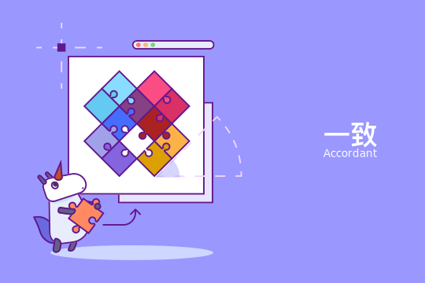

# 大标题
Uni Design设计规范体系优先使用系统默认的界面字体，字体的选择是由产品属性或品牌特性的关键词而决定。  
中文推荐：微软雅黑/思源黑体/宋体 ，其中 iOS 系统默认中文字体是「苹方 (PingFang)」，Android 系统中文字体使用「思源黑体 (Noto Sans CJK)」  
英文推荐：Arial，Helvetica Neue其中 iOS 系统默认英文字体为「San Francisco」，Android 系统默认英文字体为：「Roboto」  

## 目录

>

## 一级标题1
- [type=horizontal]
### 二级标题
Uni Design设计规范体系优先使用系统默认的界面字体，字体的选择是由产品属性或品牌特性的关键词而决定。  
中文推荐：微软雅黑/思源黑体/宋体 ，其中 iOS 系统默认中文字体是「苹方 (PingFang)」，Android 系统中文字体使用「思源黑体 (Noto Sans CJK)」  
英文推荐：Arial，Helvetica Neue其中 iOS 系统默认英文字体为「San Francisco」，Android 系统默认英文字体为：「Roboto」  

- 

>

- [type=horizontal]
### 二级标题
Uni Design设计规范体系优先使用系统默认的界面字体，字体的选择是由产品属性或品牌特性的关键词而决定。  
中文推荐：微软雅黑/思源黑体/宋体 ，其中 iOS 系统默认中文字体是「苹方 (PingFang)」，Android 系统中文字体使用「思源黑体 (Noto Sans CJK)」  
英文推荐：Arial，Helvetica Neue其中 iOS 系统默认英文字体为「San Francisco」，Android 系统默认英文字体为：「Roboto」  

- 
  

>

## 一级标题2
- [type=horizontal]
Uni Design设计规范体系优先使用系统默认的界面字体，字体的选择是由产品属性或品牌特性的关键词而决定。  
中文推荐：微软雅黑/思源黑体/宋体 ，其中 iOS 系统默认中文字体是「苹方 (PingFang)」，Android 系统中文字体使用「思源黑体 (Noto Sans CJK)」  
英文推荐：Arial，Helvetica Neue其中 iOS 系统默认英文字体为「San Francisco」，Android 系统默认英文字体为：「Roboto」  

- 
  

>

## 一级标题3
- [type=horizontal]
Uni Design设计规范体系优先使用系统默认的界面字体，字体的选择是由产品属性或品牌特性的关键词而决定。  
中文推荐：微软雅黑/思源黑体/宋体 ，其中 iOS 系统默认中文字体是「苹方 (PingFang)」，Android 系统中文字体使用「思源黑体 (Noto Sans CJK)」  
英文推荐：Arial，Helvetica Neue其中 iOS 系统默认英文字体为「San Francisco」，Android 系统默认英文字体为：「Roboto」  

- 1.内容而都玩得开挖机的挖掘。2..呢哦哦嗯啊都的挖矿 

>

## 一级标题
- [type=horizontal] 
### 二级标题
  Uni Design设计规范体系优先使用系统默认的界面字体，字体的选择是由产品属性或品牌特性的关键词而决定。  
  中文推荐：微软雅黑/思源黑体/宋体 ，其中 iOS 系统默认中文字体是「苹方 (PingFang)」，Android 系统中文字体使用「思源黑体 (Noto Sans CJK)」  
  英文推荐：Arial，Helvetica Neue其中 iOS 系统默认英文字体为「San Francisco」，Android 系统默认英文字体为：「Roboto」    
  哈哈哈哈哈哈
  **实例**   
  1.  Uni Design设计规范体系优先使用系统默认的界面字体，字体的选择是由产品属性或品牌特性的关键词而决定。 
  2.  Uni Design设计规范体系优先使用系统默认的界面字体，字体的选择是由产品属性或品牌特性的关键词而决定。
  3.  Uni Design设计规范体系优先使用系统默认的界面字体，字体的选择是由产品属性或品牌特性的关键词而决定。

- 

